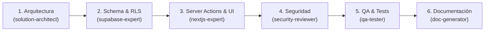

# Catálogo de Prompts y Agentes de IA · FutPro Manager

Esta guía documenta los **prompts**, **agentes especializados** y **reglas de contexto** disponibles en el repositorio para acelerar el desarrollo asistido por Inteligencia Artificial (GitHub Copilot, Claude, Cursor, ChatGPT o Antigravity) manteniendo la coherencia arquitectónica y de seguridad del proyecto.

---

## 1. Estructura de Asistencia por IA

El proyecto cuenta con un sistema modular en `.github/` y `docs/prompts/` compuesto por:

```txt
docs/prompts/
├── README.md               ← Esta guía y catálogo de prompts/agentes
└── AI_CONTEXT.md           ← Resumen ejecutivo del dominio, prioridades y tablas base

.github/
├── copilot-instructions.md ← Instrucciones globales para asistentes de código
├── prompts/                ← Plantillas de prompts parametrizadas por tarea
│   ├── create-dashboard.prompt.md
│   ├── create-football-module.prompt.md
│   ├── create-form.prompt.md
│   ├── create-nextjs-page.prompt.md
│   ├── create-rls-policy.prompt.md
│   ├── create-server-action.prompt.md
│   ├── create-supabase-table.prompt.md
│   └── create-ui-component.prompt.md
├── instructions/           ← Reglas técnicas modulares
│   ├── code-style.instructions.md
│   ├── nextjs-app-router.instructions.md
│   ├── role-access.instructions.md
│   └── supabase-security.instructions.md
└── agents/                 ← Perfiles de roles de agentes especializados
    ├── solution-architect.agent.md
    ├── nextjs-expert.agent.md
    ├── supabase-expert.agent.md
    ├── ui-ux-designer.agent.md
    ├── security-reviewer.agent.md
    ├── qa-tester.agent.md
    └── documentation-generator.agent.md
```

---

## 2. Catálogo de Prompts Disponibles (`.github/prompts/`)

Usa estos prompts como base para solicitar nuevas piezas de software al asistente:

| Archivo de Prompt | Propósito | Argumento sugerido |
|---|---|---|
| **[`create-football-module.prompt.md`](../../.github/prompts/create-football-module.prompt.md)** | Crea un módulo deportivo completo (schema, actions, páginas y componentes). | `Módulo: liga/equipo/jugador/partido y alcance funcional` |
| **[`create-supabase-table.prompt.md`](../../.github/prompts/create-supabase-table.prompt.md)** | Genera una nueva migración SQL con UUIDs, triggers de fecha y RLS habilitado. | `Nombre de tabla y propósito de negocio` |
| **[`create-rls-policy.prompt.md`](../../.github/prompts/create-rls-policy.prompt.md)** | Define políticas RLS estrictas para lectura/escritura según el rol del usuario. | `Tabla, rol objetivo y operación (SELECT/INSERT/UPDATE/DELETE)` |
| **[`create-server-action.prompt.md`](../../.github/prompts/create-server-action.prompt.md)** | Implementa una acción de servidor tipada con validación Zod y auditoría best-effort. | `Operación de negocio y archivo actions.ts objetivo` |
| **[`create-nextjs-page.prompt.md`](../../.github/prompts/create-nextjs-page.prompt.md)** | Crea una página Server Component en el App Router con control de acceso y loading states. | `Ruta objetivo (ej. /dashboard/leagues/[slug]/...)` |
| **[`create-dashboard.prompt.md`](../../.github/prompts/create-dashboard.prompt.md)** | Diseña o extiende vistas del panel de control con métricas, tarjetas y navegación contextual. | `Rol o alcance del panel a extender` |
| **[`create-form.prompt.md`](../../.github/prompts/create-form.prompt.md)** | Construye formularios interactivos con `react-hook-form`, `zod` y diseño responsive. | `Entidad a capturar y campos requeridos` |
| **[`create-ui-component.prompt.md`](../../.github/prompts/create-ui-component.prompt.md)** | Implementa componentes visuales reutilizables bajo el sistema de diseño deportivo. | `Nombre del componente y variantes visuales` |

---

## 3. Catálogo de Agentes Especializados (`.github/agents/`)

Puedes invocar o adoptar los siguientes perfiles de agente según la fase de trabajo:

| Agente | Responsabilidad Principal |
|---|---|
| **`solution-architect`** | Valida decisiones de alto nivel, modelos de datos relacionales, multi-tenancy y separación de capas. |
| **`supabase-expert`** | Experto en PostgreSQL, migraciones, RLS, triggers SQL, índices y RPCs administrativas con `SECURITY DEFINER`. |
| **`nextjs-expert`** | Especialista en App Router, Server Components, Server Actions, Suspense, ISR y streaming. |
| **`ui-ux-designer`** | Diseña interfaces mobile-first, glassmorphism deportivo, accesibilidad WCAG AA y controles táctiles (Modo Cancha). |
| **`security-reviewer`** | Audita vectores de ataque (XSS, manipulación de storage, elevación de privilegios, inyección PostgREST y políticas fail-closed). |
| **`qa-tester`** | Diseña escenarios de prueba manuales y automatizados (Vitest, Playwright), consistencia de marcadores y tablas. |
| **`documentation-generator`** | Mantiene sincronizadas las fuentes de verdad técnicas, estados de implementación y guías de usuario. |

---

## 4. Instrucciones Técnicas Modulares (`.github/instructions/`)

Estas instrucciones contienen lineamientos no negociables que todo agente o asistente debe respetar:

* **[`code-style.instructions.md`](../../.github/instructions/code-style.instructions.md)**: Convenciones TypeScript estrictas, nombramiento en inglés para código y español para UI/copy, formateo de fechas con `Intl.DateTimeFormat("es-MX")`.
* **[`nextjs-app-router.instructions.md`](../../.github/instructions/nextjs-app-router.instructions.md)**: Server Components por defecto, `"use client"` únicamente en las hojas interactivas del árbol, mutaciones aisladas en `actions.ts`.
* **[`supabase-security.instructions.md`](../../.github/instructions/supabase-security.instructions.md)**: Prohibición absoluta de `SUPABASE_SERVICE_ROLE_KEY` en frontend, uso obligatorio de `createClient()` de servidor con cookies seguras y RLS fail-closed.
* **[`role-access.instructions.md`](../../.github/instructions/role-access.instructions.md)**: Verificación en cascada de roles (`profiles.global_role`, `league_members.role`, `team_members.role`) y ocultamiento defensivo de CTAs en UI.

---

## 5. Flujo Recomendado para Nuevas Funcionalidades

Al solicitar una nueva característica a un asistente de IA, sigue este orden de ejecución:



1. **Diseño relacional y alcance**: Consulta a `solution-architect` usando `create-football-module.prompt.md`.
2. **Base de datos segura**: Genera la migración SQL con `supabase-expert` aplicando `create-supabase-table.prompt.md` y `create-rls-policy.prompt.md`.
3. **Lógica y componentes**: Implementa Server Actions y páginas usando `create-server-action.prompt.md` y `create-form.prompt.md`.
4. **Revisión de seguridad**: Pide a `security-reviewer` verificar que no haya bypass de RLS ni fuga de datos entre ligas.
5. **Aseguramiento de calidad**: Valida con `qa-tester` ejecutando `npm test`, `npm run lint` y `npm run build`.
6. **Sincronización documental**: Actualiza `docs/planning/IMPLEMENTATION_STATUS.md` y las guías de usuario correspondientes.

---

## 6. Buenas Prácticas de Prompting en FutPro Manager

* **Proveer contexto de rol:** Especifica siempre para qué rol (`super_admin`, `league_admin`, `team_admin`, `coach`, `referee`, `viewer` o aficionado público) estás diseñando la funcionalidad.
* **Referenciar archivos existentes:** Indica las rutas relativas de componentes y actions existentes para reutilizar patrones en lugar de crear código duplicado.
* **Solicitar verificación explícita:** Pide al modelo que confirme que no se requiere `service_role` y que se maneje la auditoría best-effort.
* **Consultar el contexto consolidado:** Antes de tareas de refactorización complejas, pide al asistente leer [`AI_CONTEXT.md`](./AI_CONTEXT.md).
